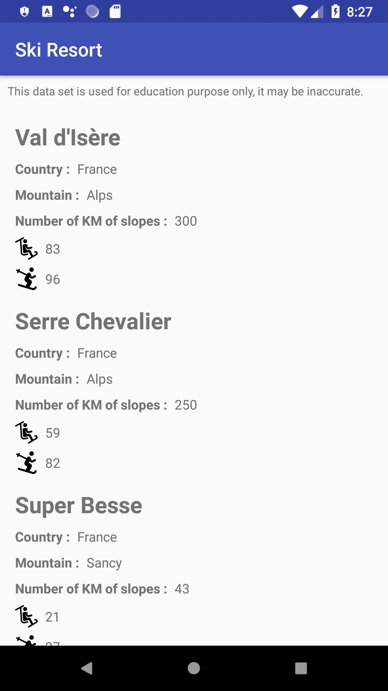
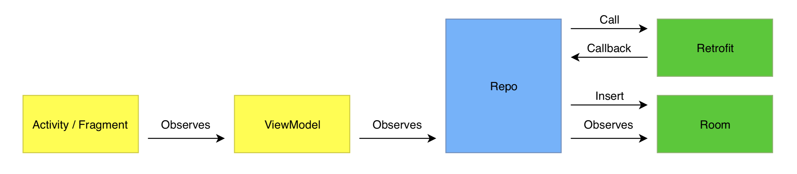

# ski-resort
Simple project to display a list of ski resort.

### This app has one screen that display a list of ski resort around the world.

Disclaimer : This data set is used for education purpose only, it may be inaccurate.

### The purpose of this project is to showcase the following Android project architecture with Jetpack components.

- Activity should include only code related to data binding.

- ViewModel contains the object to be displayed on the screen.

- Repo is responsible for asking the right data source and organizing data for the ViewModel.

- DAO classes are using Room to make SQL requests.

- Model classe are entities use by Room to create table and logic objects to be displayed.

- Retrofit is used to download data.